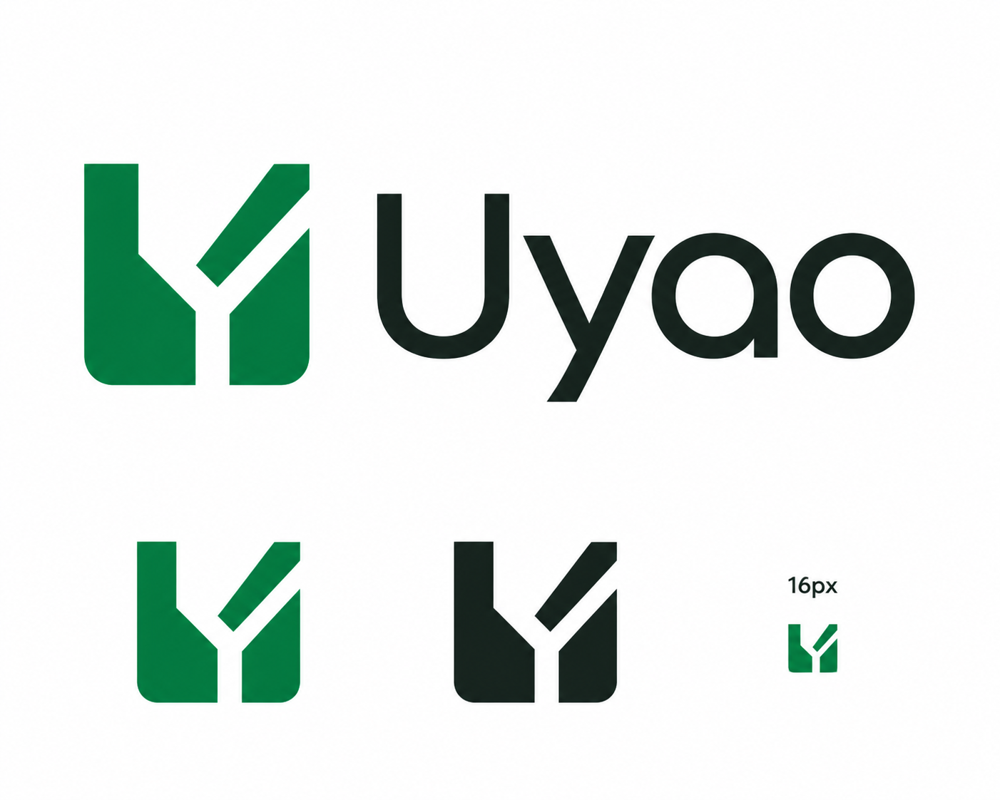
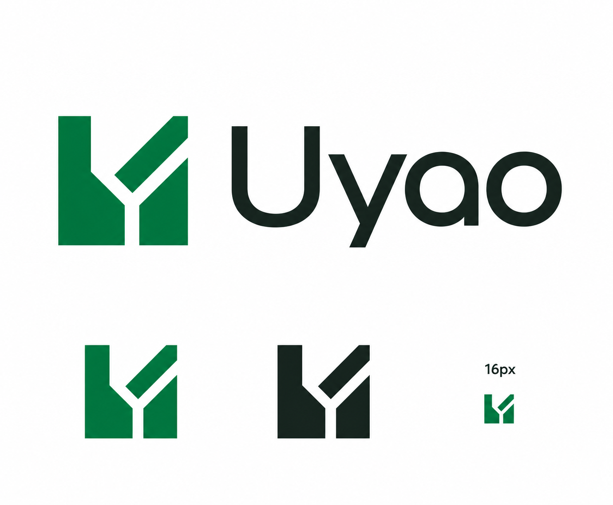
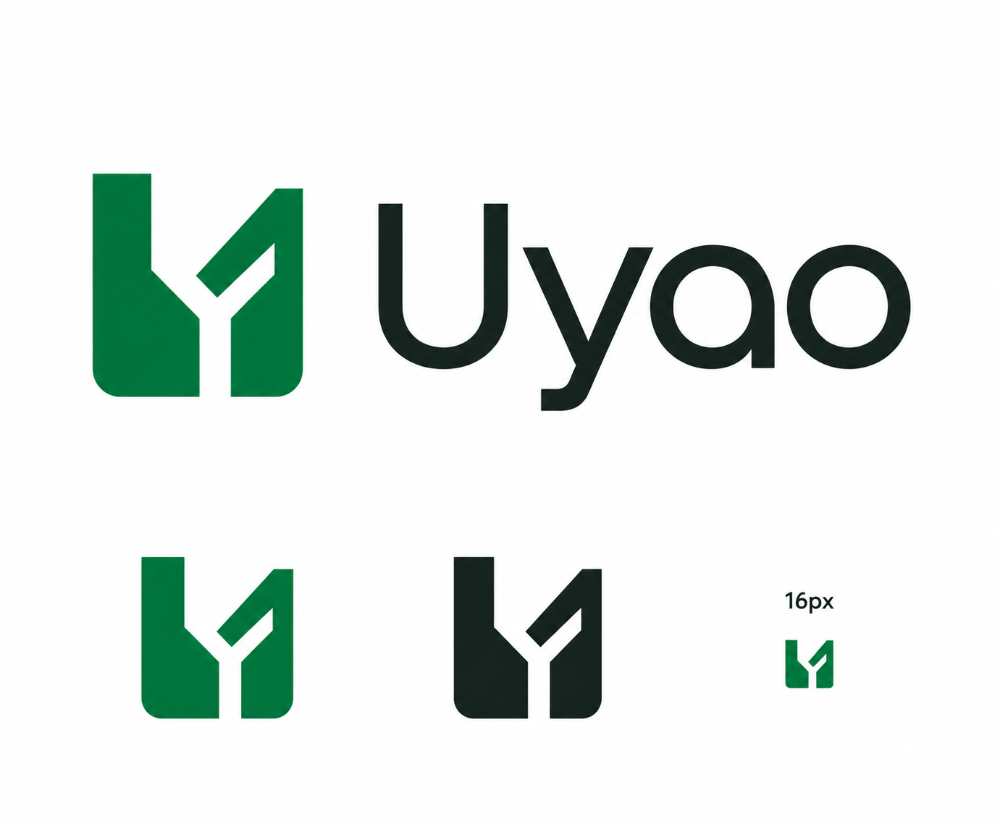
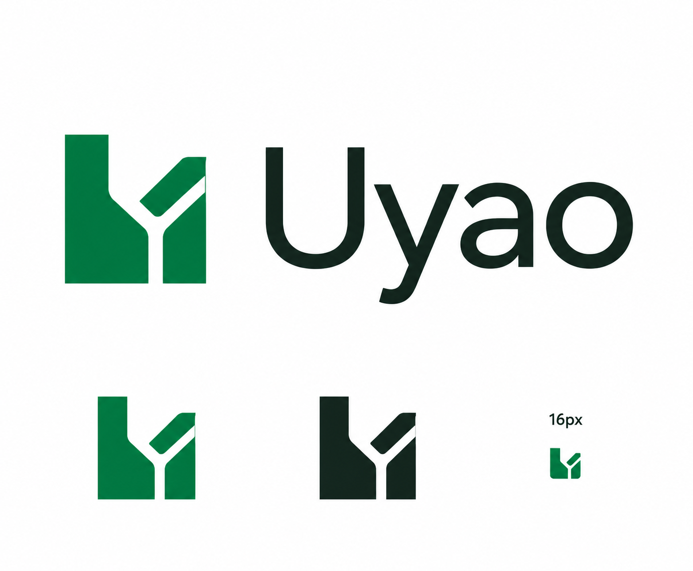

# Adjustment Pack

- Primary surface: brand-marketing
- Mode: adjustment
- Deliverable: two comparable Uyao logo refinements for founder selection
- Dimensions: 1400 x 1154 review frame; horizontal lockup, standalone mark, monochrome mark, 16 px preview
- Specialist route: Creative Production produce + built-in ImageGen; deterministic vectorization only after selection

## Reference Normalization

- Source: user-supplied Uyao U×Y logo sheet
- Reusable rules: U/Y negative-space monogram, horizontal lockup, standalone and monochrome uses, smallest-size proof
- Product-specific values: exact wordmark `Uyao`, verified green `#0B7A3E`, deep ink `#1A2420`, white
- Risky assumptions: the current diagonal should remain detached; current raster gradient is intentional; generic geometric wordmark is sufficiently ownable
- Missing requirement deferred to production: trademark clearance
- Adopted: U×Y concept, one-accent restraint, 16 px requirement
- Adapted: optical geometry, corner grammar, mark-to-wordmark balance
- Rejected: new metaphor, medical cross, pill, location pin, gradient, shadow, mascot face

## Baseline

What works:

- The U/Y monogram is compact and avoids generic medical-category symbols.
- Green, ink, and white match the existing Uyao interface tokens.
- The sheet already tests horizontal, standalone, monochrome, and 16 px use.

Observed weaknesses:

- The detached diagonal reads as a pencil, check mark, or road branch before it reads as scanning.
- Rounded lower corners conflict with the otherwise clipped, tool-like geometry.
- The oversized `y` descender and broad icon make the lockup left-heavy.
- Raster gradients and ink texture undermine the intended flat pharmacy-label system.
- The generic geometric wordmark and floating stroke pass the “AI made this” convergence test too easily.

Baseline product truth: Taiwan consumers are often mobile, rushed, and trying to avoid a wasted pharmacy trip. The brand should feel honest, verified, calm, and useful. It must not imply inventory certainty that the product does not have.

## Experience Budget and Frozen Rubric

- Audience: Taiwan urban consumers; secondary audience is independent pharmacy owners
- Environment: mobile, often outdoors or commuting
- Attention window: 1-3 seconds for brand recognition
- Frequency: low-frequency but urgent
- Stakes: medium; a wrong trip costs time and trust
- Primary feeling: verified relief
- Avoided feeling: clinical anxiety, sales pressure, generic health-app friendliness
- Experience dimensions: trust 45 / ownability 35 / small-scale clarity 20
- Primary overlay: Brand / Marketing Asset
- Frozen scoring: standard 50-point core + 50-point brand overlay from `selection-rubric.md`

Design-taste brief:

- Direction: clinical-tool modernism with a proprietary U/Y cut
- Density: spacious
- Surface: flat vector mark on white or transparent ground
- Type mood: sturdy, compact, human, precise
- Motion: static
- Do: preserve one dominant monogram; use one consistent cut angle; reduce optical weight; make wordmark feel authored; prove 16 px and monochrome use
- Don't: change the metaphor; add medical symbols; float decorative geometry; use gradients, shadows, glossy depth, or rounded-candy styling

Research: N/A - bounded adjustment with a supplied baseline and known failure modes.

## Changed Rules

### Candidate A — Precision Gate

- Retained direction: U/Y scanning-gate monogram and exact wordmark `Uyao`
- Changed rule: convert the floating diagonal into one integrated negative-space cut inside a single continuous silhouette
- Expressive mechanism: one controlled diagonal cut does all the identity work
- Strengths: strongest 16 px stability, easiest one-color production, least stock-logo decoration
- Risk: can feel slightly more technical and less friendly
- Production restraint: no more than two cut angles; no floating pieces; square outer corners with optical correction only

### Candidate B — Human Signal

- Retained direction: U/Y scanning-gate monogram and exact wordmark `Uyao`
- Changed rule: preserve the rising diagonal, but attach it structurally and balance it with a calmer, more humanist wordmark
- Expressive mechanism: the rising stroke carries motion and reassurance while the type supplies warmth
- Strengths: more approachable and closer to the supplied image
- Risk: the rising stroke may still read as a check mark or growth symbol
- Production restraint: one connected mark; short `y` descender; no decorative rounding beyond optical curve correction

## Invariants

- Exact spelling and capitalization: `Uyao`
- Exact core palette: `#0B7A3E`, `#1A2420`, white
- Preserve U/Y recognition and the horizontal/standalone/monochrome/16 px test set
- No green medical cross, pill, bottle, location pin, heart, caduceus, mascot face, gradient, shadow, 3D, or invented claim
- Generated outputs are direction evidence, not canonical logo artwork

## Before/After Evidence

Comparison contract: same source image, exact wordmark, palette, review-frame contents, rendering route, and evidence quality. Only the declared structural rule differs.

### Baseline

### Candidate A — Precision Gate

### Candidate B — Human Signal

Generated-fixture caveat: both candidates retain slight raster tonal variation despite the flat-color prompt. This is an ImageGen artifact, not an approved brand rule. Any selected direction must be rebuilt deterministically with exact solid fills.

## Visual Evaluation

Weights were frozen before rendering. Independent review used the standard 50-point core plus the 50-point Brand / Marketing Asset overlay.

| Criterion | Weight | Baseline | A | B |
|---|---:|---:|---:|---:|
| Truth and purpose | 15 | 3.4 | 3.5 | 4.0 |
| Visual hierarchy | 10 | 3.5 | 4.0 | 4.2 |
| System coherence | 10 | 3.3 | 3.8 | 4.3 |
| Distinctiveness | 5 | 3.0 | 3.1 | 3.8 |
| Accessibility | 5 | 3.6 | 4.0 | 4.2 |
| Production feasibility | 5 | 4.5 | 4.7 | 4.6 |
| Concept strength | 15 | 3.4 | 3.5 | 4.2 |
| Typographic and mark integrity | 15 | 3.2 | 3.7 | 4.1 |
| Cross-asset extensibility | 10 | 4.0 | 4.2 | 4.5 |
| Non-derivative identity | 10 | 3.0 | 3.1 | 3.8 |
| **Weighted total / 100** | **100** | **68.7** | **74.1** | **83.1** |

Visible judgment:

- Baseline and A retain a detached diagonal, so the mark still reads as a check, pencil, fragment, or road branch before scanning.
- B connects the rising stroke to the right body, producing one stable silhouette and clearer small-size structure.
- A's square base is more precise but pushes the brand toward architecture or infrastructure rather than calm consumer utility.
- B's rounded lower optical correction agrees with the curved wordmark, but production must keep it subtle so the mark does not become candy-like.
- The generic geometric wordmark remains the largest unresolved stock-logo signal in every candidate. The selected vector pass should author the `U`, `y`, and `a` terminals rather than accepting a default font unchanged.

Anti-slop check:

- No medical cross, pill, heart, shield, location pin, mascot face, 3D, or decorative badge treatment.
- Candidate B reduces the strongest stock-logo signal: a floating check-like accent.
- Remaining risk: green geometric monograms are crowded territory. Trademark similarity research remains required before registration.

Disqualifier check: all candidates preserve the product truth and required uses; none invent inventory certainty or health claims. No candidate is production-approved yet.

Recommendation: **B — Human Signal**. It has the highest score and fixes the structural ambiguity while staying closest to the approved U×Y direction. Before vector production, tighten the icon/wordmark gap and test whether the upper-right negative space stays open at 16 px.

## Founder Selection and Coherent Hybrid

- D1 selection: B connected structure + A square-corner discipline
- Founder adjustment: make the identity feel more approachable and less unfamiliar
- Friendly mechanism: softer internal Y junction, warmer counters and terminals, shorter relaxed `y`, and more natural spacing; no extra decoration or candy-like rounding

The first hybrid render is retained as `hybrid-v1-rejected.png` only as process evidence. It was rejected because the outside corners became too round. The selected D2 preview restores a square exterior and keeps the friendlier wordmark. Generated tonal variation and the optically loose upper-right join are not production rules; both must be corrected in the deterministic vector.

## Verification

- Status: comparable evidence rendered and independently reviewed
- Creative Production board: `2f93f992-d69a-4948-9d6d-f4271d6491e7`
- Candidate files: present and non-empty
- D1: completed by founder
- D2: approved by founder on 2026-08-05
- Production: deterministic SVG, reverse-color proof, and 16/32 px pixel tests passed
- Remaining external gate: trademark similarity search
